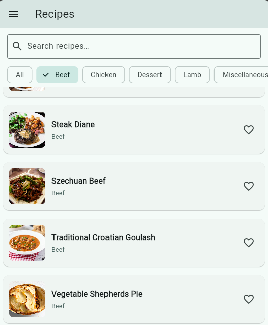
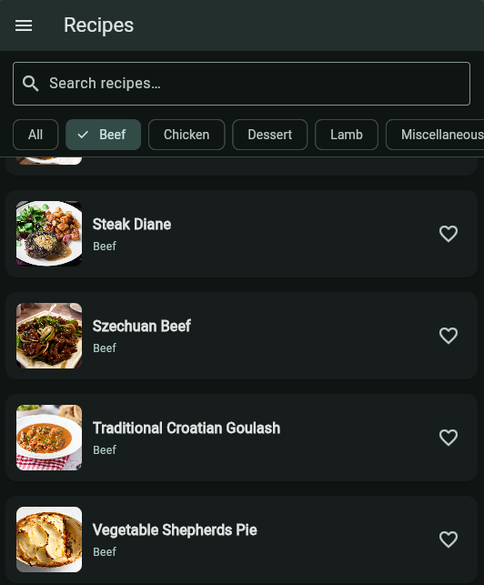
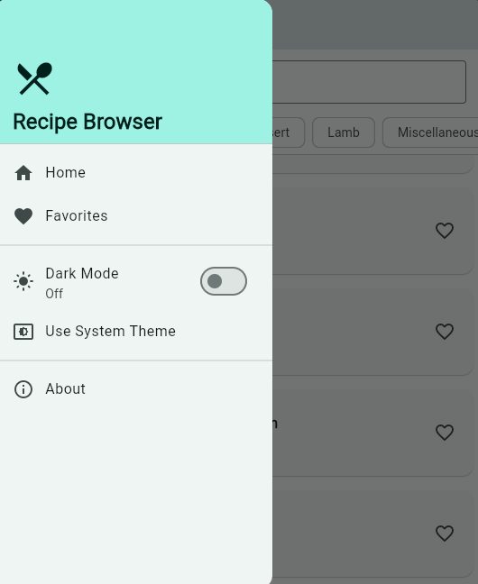
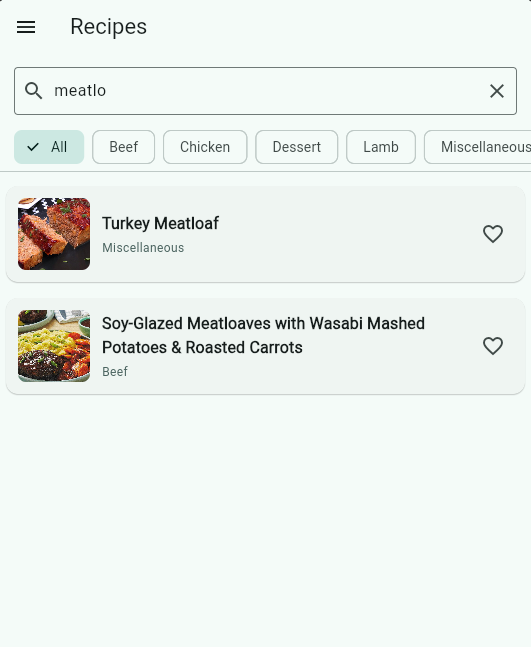
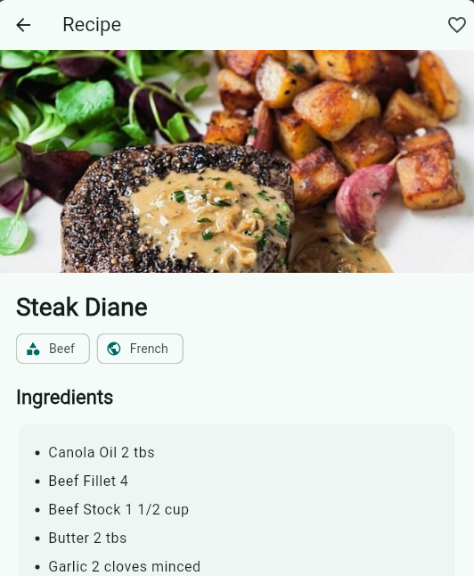
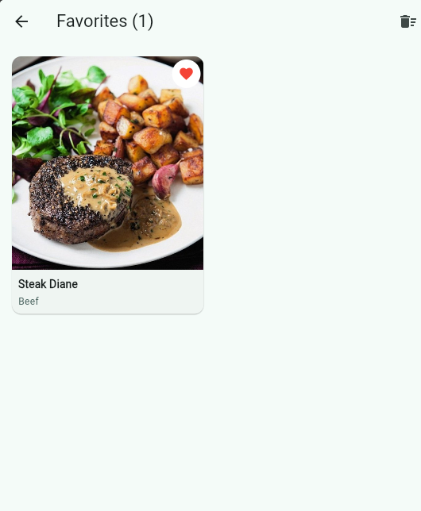
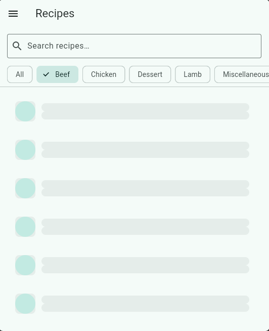

# Recipe Browser

A polished Flutter app that browses recipes from TheMealDB. Includes search, category filters (with an “All” mixed feed), detailed views, favorites with local persistence, and dark mode.

I have built this app is built to meet Kolaborate’s take‑home assignment criteria: code quality and organization, functionality, UI/UX, error handling, and documentation clarity.

Planning phase is shown in the CHANGELOG.md file

## Demo (screenshots)

### Home Screen (Light & Dark Mode)
 

### App Navigation & Search
 

### Recipe Details & Features
 

### Loading States


## Features

- Recipe list with thumbnails, titles, and category badges
- Search by name (debounced)
- Filter by category + All (mixed from multiple categories)
- Recipe details: hero image, ingredients parsing, instructions, YouTube link
- Favorites: add/remove, swipe-to-remove, clear all (Hive persistence)
- Smooth navigation (hero animations) and professional Material 3 UI
- Dark mode toggle (Light/Dark/System)
- Robust error and empty states with retry

## Tech Stack

- State management: flutter_riverpod
- Networking: dio
- Routing: go_router
- Models: freezed + json_serializable
- Persistence: hive + hive_flutter
- Images: cached_network_image
- Optional AI: google_generative_ai (Gemini)

## Requirements

- Flutter 3.27.x (stable) and Dart 3.6+
- Android Studio/SDK for Android; Xcode for iOS (on macOS)

## Setup (Windows PowerShell)

```powershell
# 1) Get dependencies
flutter pub get

# 2) Generate code (models with Freezed/JSON)
dart run build_runner build -d

# 3) Run (Gemini AI is optional)
flutter run            # without AI
# or, with AI suggestions enabled
flutter run --dart-define=GEMINI_API_KEY=YOUR_GEMINI_API_KEY
```

Notes:
- GEMINI_API_KEY is optional; if omitted, the app runs with AI features disabled.
- Android network permission is configured in `android/app/src/main/AndroidManifest.xml`.
- iOS ATS is configured in `ios/Runner/Info.plist` to allow HTTP(S) calls to TheMealDB.

## Running on Devices

Android:

```powershell
# Ensure an emulator or device is connected
flutter devices
flutter run -d <device_id>
```

iOS (requires macOS + Xcode):

```powershell
flutter devices
flutter run -d ios
```

Web (Microsoft Edge on Windows):

```powershell
# Run the app on Edge
flutter config --enable-web
flutter devices
flutter run -d edge
```
Notes:
- The project was also run and verified on Microsoft Edge during development on Windows.

## Architecture & Structure

- Layering: UI → Providers (Riverpod) → Repository → API client
- Feature-first folder structure
- Immutable data models with Freezed; JSON serialization with json_serializable

Key folders/files:

```
lib/
	core/
		constants/api_paths.dart        # TheMealDB endpoints
		errors/app_exception.dart       # Typed errors
		network/api_client.dart         # Dio client
		providers/theme_provider.dart   # ThemeMode state
		theme/app_theme.dart            # Material 3 themes
		utils/                          # debounce, parsing, cache
		widgets/                        # skeleton, empty, error views
	features/
		recipes/
			data/
				models/                    # Category, MealSummary, MealDetail (freezed)
				recipes_repository.dart    # API integration
			providers/                   # Riverpod providers
			presentation/                # list and detail screens
		favorites/
			favorites_service.dart       # Hive-backed persistence
			favorites_screen.dart        # Favorites UI
		suggestions/
			gemini_suggester.dart        # Optional Gemini integration
app.dart                           # Router + theme
main.dart                          # Entry point
```

## API

Base URL: `https://www.themealdb.com/api/json/v1/1/`

Endpoints used:
- `categories.php` — list categories
- `filter.php?c=<category>` — list meals for a category
- `search.php?s=<query>` — search by name
- `lookup.php?i=<id>` — recipe detail by ID

Notes:
- No server-side pagination; the app uses client-side chunking for infinite scroll.
- `filter.php` does not return category values; the repository populates them for UI badges.

## Code Generation

Run whenever models change:

```powershell
dart run build_runner build -d
```

## Testing and Linting

```powershell
flutter analyze
flutter test
```

CI: If the repository includes a GitHub Actions workflow (e.g., `.github/workflows/ci.yml`), it runs analyze, codegen, and tests on push/PR.

## UX and Implementation Notes

- Professional Material 3 UI with hero animations and elevated cards
- Detail screen uses SliverAppBar with large hero image
- Dark mode toggle in the navigation drawer (Light/Dark/System)
- Favorites grid supports swipe-to-delete and “Clear all” with confirmation
- ErrorView includes retry; EmptyState conveys helpful context

## Assumptions & Trade-offs

- “All” feed fetches multiple popular categories and shuffles results for variety
- Client-side pagination due to TheMealDB limitations
- Minimal offline behavior: cached categories and last successful list in memory; persistent favorites in Hive
- Gemini AI suggestions are optional and only enabled if an API key is provided via `--dart-define`

## Troubleshooting

- Codegen errors (Freezed/JSON):
	- Ensure you ran `dart run build_runner build -d`
	- If stuck, try `flutter clean ; flutter pub get ; dart run build_runner build -d`
- Android network issues: confirm Internet permission is present in manifest (already configured)
- iOS network issues: ATS is configured in `Info.plist`; rebuild the app if you recently changed it

## Routes

- `/` — Recipe list (search + filter + pagination)
- `/detail/:id` — Recipe detail
- `/favorites` — Favorites list

## App Name and Platform Config

- App name: “Recipe Browser” on both Android and iOS
- Android: `android:label` set; Internet permission enabled
- iOS: `CFBundleDisplayName/CFBundleName` set; ATS allows necessary network traffic

## Time Log (total estimated time 4hrs)

- This app was built in two phases, first phase from 6:00pm to 8:00pm and the second phase from 8:00am to 9:00am

- Planning & setup: 25 min
	- Interpreted assignment requirements and defined success criteria
	- Selected stack (Riverpod, Dio, go_router, Freezed, Hive)
	- Created feature‑first structure and initialized project/repo

- Data layer & models (Freezed, Dio, repository): 45 min
	- Implemented Dio client, API paths, typed errors
	- Defined Freezed models (Category, MealSummary, MealDetail) + JSON
	- Wrote repository methods (categories, filter, search, detail, mixed “All”) and parsing utility

- List/search/filter (debounced) + pagination: 60 min
	- Built list screen with debounced search and horizontal category chips incl. “All”
	- Implemented client‑side pagination and professional cards with hero images
	- Wired providers for categories, selected category, meals

- Recipe details (ingredients parsing, hero, instructions): 35 min
	- Detail provider/screen with SliverAppBar hero image
	- Parsed ingredients/measures from raw JSON; added YouTube button
	- Ensured smooth navigation and consistent theming

- Favorites (Hive) + favorites screen UX: 30 min
	- Hive init; toggle/check; grid layout with cached images
	- Swipe‑to‑delete and “Clear all” with confirmation dialogs
	- Instant favorite state refresh via lightweight notifier

- UI polish, dark mode, drawer, error/empty states: 15 min
	- Drawer with theme toggle (Light/Dark/System)
	- Empty and error views with retry; spacing/typography refinements

- Platform config (Android/iOS names, permissions/ATS): 10 min
	- Android: app label + Internet permission
	- iOS: CFBundleDisplayName/Name and ATS

- Documentation (README, CHANGELOG): 20 min
	- Wrote complete README (setup, run, architecture, API, troubleshooting)
	- Authored CHANGELOG with development plan and time tracking

- Polishing and Final Touches
    - Adding screenshots
    - Fixing infinitie scrolling

Total: 4hrs hours


